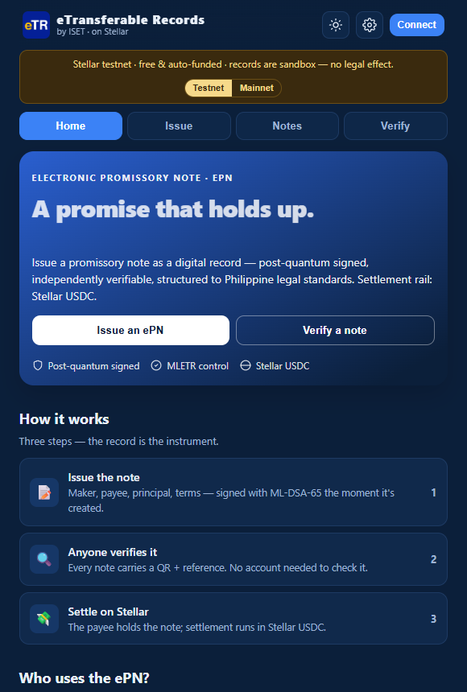
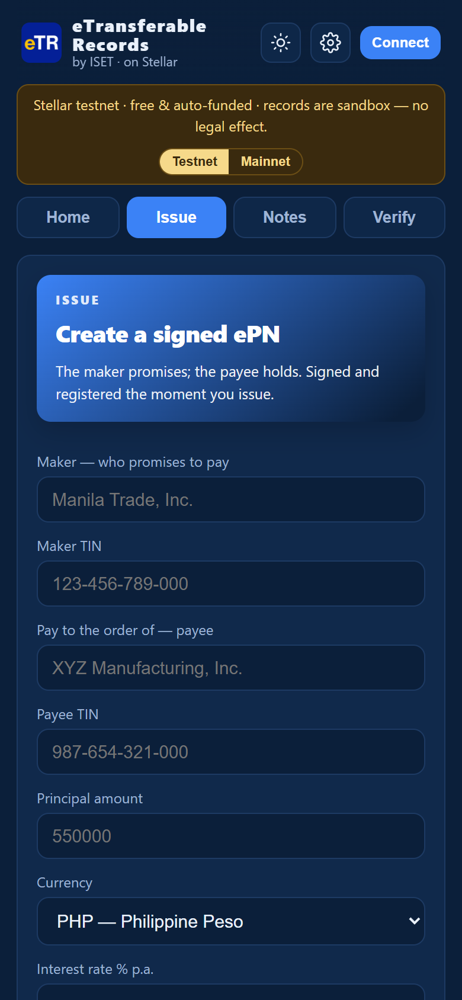
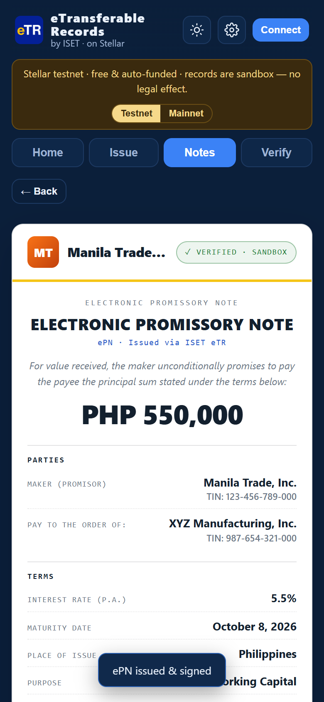

<div align="center">


# ISET eTR on Stellar

**Electronic Promissory Notes — legally-structured digital records, post-quantum signed, settling in Stellar USDC.**
*ePN is one instrument in ISET's Electronic Transferable Records (eTR) suite.*

[](https://stellar.iset.finance)
[](https://stellar.expert/explorer/public/contract/CBDFHJ2V7YBQGF4PNDPTKAALHIE6PYRBL6PVAGMJA5OFFEUMHJYQLL7O)
[](https://github.com/techfiduciary/iset-etr-stellar/actions/workflows/contract.yml)
[](contracts/epn_escrow/src/test.rs)
[](contracts/epn_escrow/Cargo.toml)
[](LICENSE)

**[Live App](https://stellar.iset.finance)** · **[Mainnet Contract](https://stellar.expert/explorer/public/contract/CBDFHJ2V7YBQGF4PNDPTKAALHIE6PYRBL6PVAGMJA5OFFEUMHJYQLL7O)** · **[Registry Engine](https://iset.finance)**

</div>

---

## ⛓️ Proof of Deployment

The `epn_escrow` Soroban contract is deployed and verifiable on **both networks**:

| Network | Contract ID | Proof |
|---|---|---|
| 🟢 **Mainnet** | `CBDFHJ2V7YBQGF4PNDPTKAALHIE6PYRBL6PVAGMJA5OFFEUMHJYQLL7O` | [Stellar Expert →](https://stellar.expert/explorer/public/contract/CBDFHJ2V7YBQGF4PNDPTKAALHIE6PYRBL6PVAGMJA5OFFEUMHJYQLL7O) |
| 🧪 **Testnet** | `CDTZDPLIB7OZ5LTCXAEY4GWUQTDKVGEGSSUWRF56MUBDNE5DSNSMXEGH` | [Stellar Expert →](https://stellar.expert/explorer/testnet/contract/CDTZDPLIB7OZ5LTCXAEY4GWUQTDKVGEGSSUWRF56MUBDNE5DSNSMXEGH) |

**Mainnet deployment transactions** (fees paid in real XLM):

| Step | Transaction | Detail |
|---|---|---|
| WASM upload | [`27dc4c53…`](https://stellar.expert/explorer/public/tx/27dc4c53f19f4c77ebb06a45ab013d663922f6abd00a98ea2d61ca82a5de7a7d) | wasm hash `7fb80059088d523730858e6ab8b90c5de8066b4bb369672c87d514cc36e695c2` |
| Contract deploy | [`5605a984…`](https://stellar.expert/explorer/public/tx/5605a984b7bc19ade6d3111b04ec393b4a55c8cedfbf2f9d46b71fb48af6d7e4) | instance `CBDFHJ2V…LL7O` |

Both networks run the **identical wasm** (`7fb80059…`) built from this repository's [`contracts/epn_escrow/`](contracts/epn_escrow/) — verified by CI on every push.

Reviewers can switch networks **directly in the app** — a Testnet/Mainnet toggle sits in the top banner of [stellar.iset.finance](https://stellar.iset.finance). Testnet is free and auto-funded (friendbot). Mainnet submits real transactions — your wallet needs an activated mainnet account (send it **2+ XLM** from any exchange; the app shows your address and a copy button if it isn't funded yet).

---

## 📱 The App

<div align="center">

<br><br>
&nbsp;&nbsp;

</div>

**What's inside:**

- **Issue an ePN** — maker (promisor) + TIN, "pay to the order of" payee + TIN, principal (PHP default), interest, maturity, purpose of note, place of issue. One tap issues a **sandbox** record on the live ISET registry: ML-DSA-65 (post-quantum) signed, hash-chained, auditable.
- **Notes** — your issued notes on this device; open any note as a signed B2B document with QR + VERIFY.
- **Verify** — anyone can re-check a record against the registry by reference; no account needed.
- **Connect** — Freighter (extension) or Albedo (web/mobile); the connected public key is bound into every note you issue.
- **Brand** — your company name, logo, details and color, applied to the note header.
- Light/dark themes, mobile-first, print-to-PDF, Testnet/Mainnet toggle.

**Try it in 60 seconds** — no wallet required for the registry flow:
1. Open **[stellar.iset.finance](https://stellar.iset.finance)** → **Issue**
2. Fill in maker, payee, amount → **Issue ePN** — a real sandbox record is created on the live ISET registry, signed with ML-DSA-65
3. The signed B2B document renders with QR + **VERIFY** — anyone can re-check it against the registry, no account needed
4. **Connect** a Stellar wallet (Freighter or Albedo) → the note registers on-chain via `init`, then **Endorse & Settle** executes `release_funds` — both return real transaction hashes with explorer links

---

## 👤 Founder

**Francis Neri — Founder & Tech Fiduciary.** A trade-finance infrastructure architect with deep expertise in legal tech. Recognizing that public blockchains lack the legal enforceability institutions require — and that institutions will not put commercial data on public chains — he designed ISET eTR as the missing **neutral trust layer**: private, legally-structured enterprise records bridged to public blockchain settlement.

ISET operates a live production registry at [iset.finance](https://iset.finance) — this repository is its Stellar settlement integration.

📫 fiduciary@iset.finance

---

## 🚀 Vision & Product

**The vision: become the default legal settlement rail for global trade.** $11T of trade still runs on paper. ISET eTR turns slow, paper-based trade finance into digitally enforceable, instantly transferable, on-chain-settleable assets.

### Core features

- **The 6-Instrument Suite** — full lifecycle support for the instruments global trade actually runs on: **ePN** (Promissory Note) · **eBE** (Bill of Exchange) · **eBL** (Bill of Lading) · **eLC** (Letter of Credit) · **eWR** (Warehouse Receipt) · **eINV** (Invoice)
- **Settlement Router architecture** — the legal state of the record (who controls it, under UNCITRAL MLETR's single-controller model) lives off-chain in the ISET registry; the **settlement state** lives on-chain. Decoupling the two means institutions keep commercial privacy while Stellar provides instant, cheap, final settlement in USDC
- **Post-quantum security** — every record is signed with **ML-DSA-65 (NIST FIPS 204)** and anchored to a hash-chained audit ledger, future-proof against quantum threats
- **Privacy-first by design** — commercial terms never touch the chain (Data Privacy Act-aligned); the blockchain holds only the settlement state
- **Legal structure** — records are structured to **RA 8792** (PH E-Commerce Act) and aligned to **UNCITRAL MLETR**, with instrument-specific framing under the Negotiable Instruments Law (Act 2031), UCP 600/ISP98 (eLC), and RA 11057/PPSR (receivables perfection)

### Why Stellar

Sub-cent fees, 5-second finality, native USDC, and Soroban's resource-metered contracts make Stellar the right settlement rail for high-volume, low-margin trade instruments — an MSME's ₱50,000 invoice deserves the same settlement quality as a $10M bill of lading.

---

## 🗺️ Roadmap

| When | Milestone | Status |
|---|---|---|
| **Q3 2026** | ePN factoring flow live end-to-end: app + registry + Soroban contract on **testnet and mainnet**; 8/8 contract tests (CI); records structured to RA 8792 / aligned to MLETR | ✅ **Shipped** |
| **Q4 2026** | Full 6-instrument suite wired to on-chain settlement; lender-partner onboarding (PH pilot cohort) | 🔨 Next |
| **Q1 2027** | Formal smart-contract security audit; 10 institutional pilot users transacting on mainnet | 📋 Planned |
| **Q2 2027+** | Scale past 100 users; Stellar Community Fund (SCF) application for regional expansion; multi-corridor settlement | 🎯 Target |

---

## 🏗️ How It Works

```
┌────────────────────────┐        ┌──────────────────────────┐
│  ISET Registry (off-chain)      │  Stellar / Soroban (on-chain)
│  · legal state & control        │  · settlement state
│  · ML-DSA-65 signatures         │  · epn_escrow contract
│  · hash-chained audit ledger    │  · USDC settlement rail
└───────────┬────────────┘        └────────────┬─────────────┘
            │      post-quantum-signed proof   │
            └──────────────► bridge ◄──────────┘
```

**The ePN factoring flow (deployed contract):**
1. `init(maker, lender, amount, maturity, iset_pubkey)` — an MSME's promissory note is locked into the escrow; the maker must authorize
2. `release_funds(caller, iset_signature)` — the note is endorsed to a lender via the ISET registry; only the registered lender can release, and must authorize
3. `claim_default(caller)` — past maturity, the maker can claim default

If this engine can securely execute a micro ePN factoring flow, the same engine executes a $10M bill of lading.

---

## 🛠️ Stack & Repo

| Layer | Tech |
|---|---|
| Frontend | Static HTML/CSS/vanilla JS — no framework, no build step |
| Wallets | [Freighter](https://freighter.app) (extension) + [Albedo](https://albedo.link) (web, mobile-friendly) |
| On-chain | Rust / [Soroban SDK 27.0.0](contracts/epn_escrow/Cargo.toml) — [`contracts/epn_escrow/`](contracts/epn_escrow/) |
| Registry & signing | Production ISET engine ([iset.finance](https://iset.finance)), sandbox scope |
| Hosting | Cloudflare Pages |

```
├── index.html              # the entire app (Home · Issue · Notes · Verify · Brand)
├── assets/                 # icons + screenshots
└── contracts/epn_escrow/   # Soroban contract (Rust) + 6-test suite
    ├── src/lib.rs          # init / release_funds / claim_default
    └── src/test.rs         # cargo test → 8 passing (CI-verified)
```

### Run locally

```bash
# App — any static server:
npx serve .

# Contract — build + test:
cd contracts/epn_escrow
stellar contract build     # wasm32v1-none target
cargo test                 # 8 tests: settle, double-settle, access control, zero-amount, maturity
```

> Deploying the site? Run `rm -rf contracts/epn_escrow/target` first — Rust debug artifacts exceed Cloudflare Pages' 25 MiB file limit.

---

## ⚖️ Honesty Notes

- Registry records issued from this app are **sandbox**: fully signed, fully verifiable, **no legal effect**.
- MLETR-ready. UNCITRAL Model Law for Electronic Transferable Records is cited as the design standard the records are **aligned to**.
- The on-chain demo registers the connected wallet as both maker and demo-lender so reviewers can execute the full flow solo with real transactions.

## License

MIT — see [LICENSE](LICENSE).

---

<div align="center">

**© 2026 ISET eTR** · [stellar.iset.finance](https://stellar.iset.finance) · fiduciary@iset.finance

</div>
